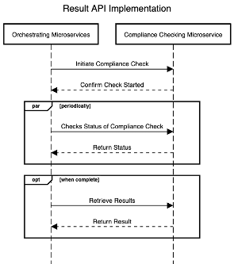

# ACCORD APIs

This page documents the ACCORD APIs. It firstly, describes the existing APIs that have been re-used as well as those that have been developed specifically within the ACCORD project. For the APIs that have been developed, the functionality is described as well as links to API documentation being provided.

In total, 5 APIs are defined by the ACCORD project, 3 are newly developed, and two are re-used:
1. API 1 – Definitions API (re-used)
2. API 2 – Building Codes and Rules API (developed)
3. API 3 – Information Services APIs (re-used)
4. API 4 – Data API (developed)
5. API 5 – Results API (developed).

Given that the re-used APIs already exist, they will be described briefly:

**Definitions API:** The definitions API, used to retrieve definitions from a data dictionary, that will be used by the project is the standard Building Smart Data Dictionary API Details on this API can be found [here](https://app.swaggerhub.com/apis/buildingSMART/Dictionaries/v1).

**Information Services APIs:** Information Services APIs are a collective term for any API that provides a connection between a microservice and a source of data (operated by an external third party) that it requires. Within the project, only one of these is needed (as shown in the ACCORD cloud architecture diagram), which is for the Finnish LCA Calculation Microservice. Due to how the external third party exposes this data – a simple HTTP request was all that was required to be implemented.

##	Building Codes and Rules API
The building codes and rules API is designed to allow other components within the ACCORD cloud architecture to retrieve building codes and rules in a standardised format. A full API description for the developed API is available . 
This API provides the following endpoints:

1.	Retrieval of regulations server metadata.
2.	Retrieval of the latest version of a building code in both YAML and JSON-LD.
3.	Returns a specified version of the building code.
4.	Execute a graphQL query over a building code.
5.	Return IDS for a given building code (and or version).
6.	Creates a new building code
7.	Returns a specific section or paragraph of the building code.

It should be noted that the building codes and rules API returns data in either JSON-LD or YAML to give integrators the freedom to choose the format that best suits their use case.
A comparison of the functionality of this API and the relevant technical requirements defined in D4.1 is given in Table 14.

The API Documetation for this API can be found [here](https://docs.accordproject.eu/buildingcodesandrules.html)

## Data APIs

The data API is designed to allow other components within the ACCORD cloud architecture to retrieve building model data. A full API description for the developed API is available . 
This API provides the following endpoints:

1.	Return a given model based on a model ID
2.	Execute a graphQL query (if supported by the model format) of a given model ID.

A comparison of the functionality of this API and the relevant technical requirements defined in D4.1 is given in Table 15.

The API Documetation for this API can be found [here](https://docs.accordproject.eu/data.html)

##	Results API
The results API is designed to allow other components within the ACCORD cloud architecture, especially the orchestrating microservices components, to interact with compliance-checking microservices. All compliance-checking services should implement this API to integrate with the rest of the ACCORD cloud services. A full API description for the developed API is available . 
This API provides the following endpoints:

1.	Retrieve the metadata about compliance checking microservice and its capabilities. This includes:
	1.	A list of model formats that the microservice supports
	2.	A list of building code terms (as described in the data dictionary) that this microservice can support.
2.	Initiates compliance checks. This operates in two modes to support differing integration scenarios:
	1.	Initiating a compliance check across an entire building code.
	2.	Initiating a compliance check for a given building code term (or set of terms).
3.	Retrieving the status of a compliance check.
4.	Retrieving the results of a compliance check in either JSON or BCF format.

It is important to note that the API utilises an asynchronous design, this is to enable compliance checks (which may take some time) to operate in parallel. This is shown in the sequence diagram shown below:

The API Documetation for this API can be found [here](https://docs.accordproject.eu/results.html)