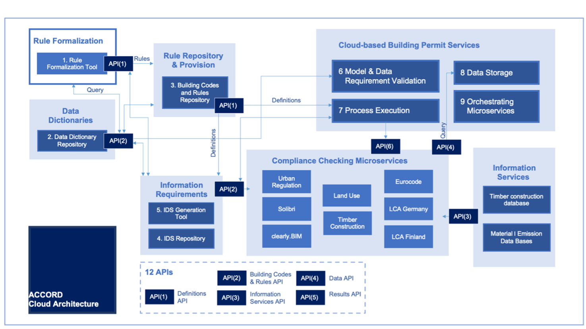
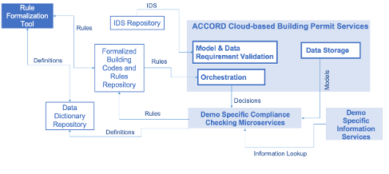

# ACCORD Cloud Architecture

The ACCORD cloud architecture itself is designed to be flexible, enabling individual nationals and municipalities to select the components and their integration based on the needs of their permitting processes. Thus, each ACCORD demonstrator will use a subset of the components defined below. 

The ACCORD Cloud Architecture was dervived from  the ACCORD Semantic Framework and the elicited ACCORD technical requirements.

The ACCORD Cloud Architecture contains twelve main components:

1.	Rule Formalization: The Rule Formalization Tool is responsible for all the various activities on the building authority side. Its subcomponents oversee various tasks that are related to formalising building codes and regulations, utilises a domain-specific rule language and managing building codes and rules.
2.	Data Dictionaries: This component provides access to data dictionaries with the aim of mapping explicit definitions and terms being present in regulatory documents. It also provides a reconciliation capability to conduct fuzzy mapping and other lookups when terminologies do not precisely align.
3.	The Rule Repository and Provision: This component provides the ability to store and translate or interpret the codes and rules provided by the Rule Formalization Tool.
4.	Information Requirements Repository: This component will be responsible for providing formalized definitions of information requirements for building permit processes to other components of the ACCORD Cloud Architecture.
5.	The Cloud-based Building Permit Services: This component manages the overall process of building permitting and acts as an intermediary between the rule provision component and the compliance checking microservices.
6.	Model and Data Requirement Validation: This component validates the building’s model (IFC format) against bSDD and IDS specifications and validates additional external data sources (e.g. a zoning/land use plan) against input requirements.
7.	Process Execution: This component executes the process flow for a building permit, from the first initial application to the final granting of the permit. It needs to interact with the microservice orchestration component to execute checks as part of the process flow.
8.	Data Storage: This component is a ‘single source of truth’ location to store the building models in IFC and cityGML format and land use plans in XPlanung format. It is accessed by other components via API for retrieving (parts of) the models with the aim of executing compliance checks.
9.	Orchestrating Microservices: This component orchestrates (coordinates) the API communication between components of the ACCORD Cloud Architecture. 
10.	Compliance Checking Microservices: This element of the architecture encompasses the various compliance checking services of ACCORD. It runs compliance checks based on the input data (building models in IFC and others) and rules and returns the results back to the process execution component.
11.	Information Services: The information services provide additional information and reasoning capabilities to compliance checking microservices such as geospatial or environmental data. 
12.	APIs: The APIs act as an intermediary between all the various components of the ACCORD Cloud Architecture.

The ACCORD cloud archiecture is show in the figure below:

Additionally, a simpler version has also been created to aid communication with external parties. This is shown below.

