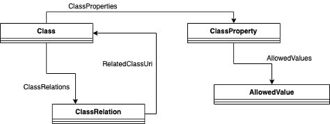

# Data Dictionary Repository

The data dictionary repository functionality is provided by bSDD (buildingSMART Data Dictionary).  The bSDD - buildingSMART Solution for Data Dictionaries is an online service hosting classes (terms) and properties, allowed values, units, translations, relations between those and more. It supports a standardised workflow to guarantee data quality, information consistency and interoperability. BIM modellers use the bSDD for easy and efficient access to all kinds of standards to enrich their models. BIM Managers use the bSDD to reference Information Delivery Specifications (IDS) and check BIM data for validity. Content creators benefit from having one entry point to various BIM tools and platforms. 

ACCORD will utilise bSDD to store regulation-specific dictionary mappings between regulatory terms and (a) model storage, (b) calculation methods (i.e. which compliance checking microservice should perform the calculation) and (c) classification codes.

Creating data dictionaries for ACCORD regulatory terms in bSDD with immediate access to the data from the software solutions integrated with the bSDD. Allowing bSDD to form a central source of true for the dictionary mappings used as part of the ACCORD cloud architecture.

The motivation for selecting an existing solution such as bSDD is: (a) it is already widely used within the construction sector, (b) it meets the requirements of the ACCORD project, and (c) it will allow ACCORD development resources to focus on more innovative areas.

Since the bSDD service already exists, only a minimal implementation was required. All that needed to be done was a mapping between the data items required by ACCORD and the bSDD schema. This schema is shown in the figure below:

At the heart of bSDD is a database with all dictionaries. Each dictionary may contain a list of classes and properties. Classes mainly define physical objects (e.g. a door) and properties are the attributes that describe classes (e.g. thickness). The content of dictionaries can be related to each other, creating a connected graph. 

To map a given term to bSDD, the following process is followed. Each term generated by the ACCORD rule formalization process is categorised as either an object or a property. If a property, it should be added to bSDD as a ClassProperty; if it is an object, it should be a Class.

If the term is an object (e.g., Door): A Class should be created in bSDD. If the term has an equivalent in any of the existing bSDD dictionaries (e.g., IFC classes or Uniclass), then relationships between the new Class and these related Class are created using a ClassRelation object. 

If the term is a property (e.g., width), the Class of the property currently being considered should be inferred from the RASE metadata present within the document (e.g., if the term is width, then the type of object to which the width is a property should be inferred). This can be done automatically. Then, depending on the selected execution type, one of the following should be performed:

1.	Simple data lookup: A relationship should be established between the inferred Class and the appropriate ClassProperty in the target bSDD dictionary (depending on what model format is the target). This serves to relate the term to a data item in the IFC model schema.

2.	Calculation Method: A new ClassProperty should be created. The bSDD IsDynamic property is set to true and a URI for the process application is also saved.

3.	Human Decision: A new ClassProperty should be created, but no other action taken.