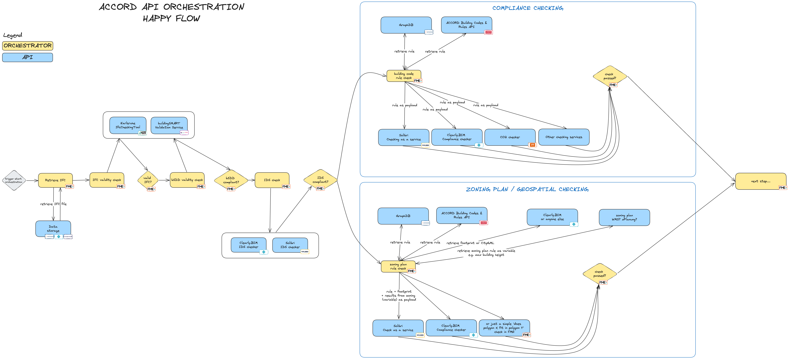
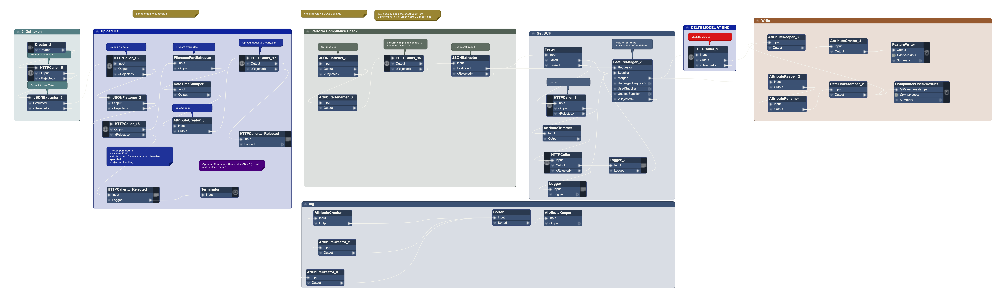

# Process Execution

The Process Execution component acts as the process backbone of the permitting process. Every permit request follows a predefined process.  That process is often prescribed by local law, but in general, consists of steps like:  
- An applicant applies for a permit.
- The applicant uploads relevant documentation, including models.
- The local permitting authority reviews the permit request and evaluates it against the relevant laws and regulation.
- The local permitting authority comes to a decision, the permit is issued, additional information or changes in the plans is required, or the permit is denied.   

This component will project the coordinating implementation of the ACCORD digitised processes for building permitting. It will thus integrate and coordinate the other components of the ACCORD Cloud Architecture, enabling the execution of building permitting process flows specific to the local process required by permitting authorities. 

For the implementation of this component, two parallel tracks were explored during the ACCORD project.

## Use an existing permitting and licensing platform and extend it with functionality to invoke external functionalities through API. 

In ACCORD, this platform was provided by Lupapiste, a Cloudpermit permitting service. From the Cloudpermit application, specific checks were initiated based on configurations managed by the system administrators. This allowed for only initiating those checks that are relevant for the specific context of a permit application (for example based on work type and building type). 
The permitting service contains the state machine, a configurable component to manage each application’s stage and status. The main stages are usually pre-consultation, application and construction. Under  `the stages the process is divided into phases. Examples of typical statuses in the application stage are draft, submitted, in review, changes requested, and permit issued. The process is often iterative. 

Automatic compliance checking adds new statuses under the application stage. When the models are submitted to the service for automatic checking, the application itself is not yet submitted. Thus, there is a pre-checking status, where the designers can make sure their submission will be compliant with the data requirements and the building code. 
- The status of each model is managed separately  
- The first status of a model is submitted.  
- The first check is about data validation (IDS or proprietary format). Data-validated status means that the IFC model has been done according to the local BIM specifications, and it contains the required information in the correct places. Having the data correct is a prerequisite for compliance checks. 
- The second check is about the building code compliance. If the checks return errors, a corrected version of the model needs to be submitted for checking, or the designers must provide the reason for exceptions before the application can be submitted.  

Execution of checks is configurable. The checks usually apply to only certain types of projects or buildings, not all. Although the orchestration components and microservices could manage which rules should be checked, Cloudpermit can make it more efficient by only providing the relevant checks in the context. The configuration is managed by the system administrators and can be changed when there are new or changed checks. The Cloudpermit process execution is designed to work well with integration strategy B (chapter 5) as it is agnostic to the content and result of each atomic check. 

## Use an external orchestration component (with a wider scope than just the compliance checking microservice orchestration). 

This track was not part of the initial scope of the ACCORD project but during the project the need for better understanding 'orchestration' arose. Future Insight experimented with using FME as an orchestration component.  

The aim is to technically and practically explore the workings of a permit process orchestrator. A permit process orchestrator combines multiple tools/services (check) suppliers and can do this following a logical order. For example, this could be: Determine the type of checks to be executed; Validate the IFC-model; Perform checks; show results.   

For the exploration of the orchestration concept within the scope of BIM-based permit checking, we defined a 'happy flow' for a permit process. We refer to this as a happy flow because it follows a path that is not blocked by, for example, invalid data or the unavailability of actual checks. The main goal was to a keep momentum and progress and b to check to what extent the components in the ACCORD Architecture are already ‘orchestratable’. 

On an abstract level, the happy flow consists of the following steps: 
- The process is initiated by e.g. a permit and licensing platform. 
- The IFC model is stored in some centralized storage (see 3.8 Data Storage Component) and picked up by the orchestrator from there. 
- The model is then sent to an IFC/bSDD Validation service. 
- After successful IFC/bSDD validation, it is sent to an IDS checking service. 
- After successful IDS checking, we consider two possible paths: 
    - Normal 'Compliance checking' which only requires a check definition and the contents of the IFC. 
    - Zoning plan/geospatial checking, which, in addition, also requires data from an external source that is possibly location specific, e.g. a zoning plan providing a location-specific value for the maximum building height. 
- End of happy flow 

A visualization of this “happy flow” is shown below:

FME has been used as a tool for testing this happy flow, as it has the capabilities of designing an automated workflow, including the consumption of API’s. 

In addition, FME allows us to do quick data manipulations on models, input GIS data, rules and others, allowing us to quickly solve (and document that we took a shortcut) problems that would otherwise fully block progress. 

Separate FME 'Workspaces' are used to call separate API microservices and process results.  These are the yellow blocks in the flow. FME Flow is used to tie the workspaces together. That allows us to easily remove or replace entire API microservices from the flow, e.g., replacing compliance checking service A with service B.  

