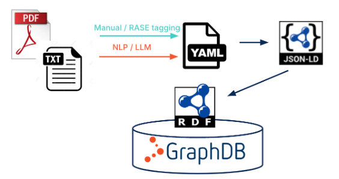

# Semantic Storage

[Ontotext GraphDB(TM)](https://graphdb.ontotext.com) is an RDF database, it is chosen as a data storage created in compliance with the Semantic Web technologies stack, to adopt its best practices to serve regulation compliance checks. 

Ontotext GraphDB(TM) is used in ACCORD semantic framework in the following ways:  

- As a storage for regulation graphs generated from the building code text sources with the help of the Rule Formalization Tool. 

- As a storage of an enhanced version of buildingSmart Data Dictionary, Semantic bSDD, fully compliant with the Semantic Web technologies stack. 

- As a storage for German use case 1 data.

In this section technical details of Ontotext GraphDB(TM) usage are described. 

Correspondent endpoints and their URLs are given in the table below.

|Endpoint name |URL address |
|--------------|------------|
|GraphDB               | https://graphdb.accordproject.eu/graphdb |
|SPARQL                | https://graphdb.accordproject.eu/graphdb/sparql |
|Semantic bSDD GraphQL | https://bsdd.ontotext.com/graphiql/ |
|Semantic bSDD SPARQL  | https://bsdd.ontotext.com/graphdb/sparql/ |

## GraphDB as the storage for regulation graphs 

The regulation graphs obtained within the Rule Formalisation Tool in the form of JSON-LD files are uploaded to Ontotext GraphDB(TM) via REST API provided by GraphDB Workbench. 

The steps of the transformation are given at the picture

The list of API calls to GraphDB used in ACCORD project got Building Codes and Rules is given here [graphdb-webapi.md](https://github.com/Accord-Project/API-Development/blob/main/BuildingCodesAndRules/graphdb-webapi.md).

The full description of Ontotext GraphDB(TM) REST API abilities is given at the link [https://graphdb.accordproject.eu/graphdb/webapi](https://graphdb.accordproject.eu/graphdb/webapi). 

A dedicated repository `aec3po` keeps the latest versions of regulation graphs created for a particular building code.  

JSON-LD is a lightweight Linked Data format. It is easy for humans to read and write. It is based on the JSON format and provides a way to help JSON data interoperate at Web-scale. 

Building Codes and Rules API is created to communicate rules from Ontotext GraphDB(TM) to other components. Building Codes and Rules API description is defined in [https://accord-project.github.io/API-Development/buildingcodesandrules.html](https://accord-project.github.io/API-Development/buildingcodesandrules.html)

Important note: all calls should go to `https://graphdb.accordproject.eu/graphdb/repositories`. Default GraphDB WebAPI generated path is `https://graphdb.accordproject.eu/repositories`, so when try from the Workbench UI the API calls won't work. 

## Semantic bSDD

Semantic bSDD is made to improve the GraphQL, JSON and RDF representations of [buildingSmart Data Dictionary](https://www.buildingsmart.org/users/services/buildingsmart-data-dictionary/). The reasons of creating Semantic bSDD, thorough analysis of the original bSDD, recommendations and enhancements proposed, implemented and left for future work together with all the technical details of the work done are available at [https://github.com/Accord-Project/bsdd] (open source). 

The working demonstrator is available at the link [https://bsdd.ontotext.com](https://bsdd.ontotext.com). Supported are: 

SPARQL endpoint using Ontotext GraphDB(TM): 

- [GraphDB Workbench: administrative interface for Semantic bSDD](https://bsdd.ontotext.com/graphdb)

- [GraphDB SPARQL endpoint](https://bsdd.ontotext.com/graphdb/repositories/bsdd)

- [GraphDB SPARQL editor](https://bsdd.ontotext.com/graphdb/sparql) 

GraphQL endpoint using Ontotext Platform Semantic Objects(TM):  

- [Refactored GraphQL endpoint](https://bsdd.ontotext.com/graphql), 

- [Refactored GraphQL query editor](https://bsdd.ontotext.com/graphiql) 

## GraphDB as the storage for German use case 1 data 

Ontotext GraphDB(TM) is used as the storage for [German use case 1 data](https://accordproject.eu/wp-content/uploads/2023/09/ACCORD_D1.2_ACCORD-Framework-and-User-Requirements-Specification.pdf), namely, land use development plans of the land under Tegel airport and building information models of several buildings of Tegel airport. The description of the use case is provided in the Section 5.1 of the [ACCORD Deliverable D1.2](https://accordproject.eu/wp-content/uploads/2023/09/ACCORD_D1.2_ACCORD-Framework-and-User-Requirements-Specification.pdf). 

Land use development plans are given in the form of [XPlanXML](https://xleitstelle.de/xplanung/ueber_xplanung) files, and to be uploaded and then queried in Ontotext GraphDB(TM) they undergone conversion from XPlanXML into RDF/Turtle done with custom script written in [XSPARQL](https://www.w3.org/submissions/xsparql-language-specification/). 

Building information models (BIMs) are given in the form of IFCx4 files, and to be uploaded and then queried in Ontotext GraphDB(TM) they are converted from IFCx4 to [CityGML 3.0](https://www.ogc.org/publications/standard/citygml/) with the help of a custom FME workflow, and then converted from CityGML 3.0 into RDF/Turtle with another custom script written in XSPARQL. 

Important note: the geometries in XPlanXML are given originally in GML format, and to be used within Ontotext GraphDB(TM) they are converted into WKT using custom Python code. 

The data of land usage plans are stored in GraphDB repositories `12-50a`, `12-50ba` and `12-62a`, corresponding to the names of building plans.

Each repository contains:

- the unnamed default graph - stores common SKOS concept schemas for enumerations and code values reused within XPlanXML;
- `landuse` - the land use data from XPlanXML for the particular building plan;
- `ifc` - the partial conversion of building information models (BIMs) of Tegel airport from IFC4 to CityGML3.0 with FME conversion and then XSPARQL conversion to RDF;
- `ifclbd` - the complete conversion of BIMs from IFC4 to CityGML3.0 with [IFC-to-LBD conversion](https://github.com/jyrkioraskari/IFCtoLBD);
- `toporels` - the precalculated topological relations between land parcels and BIMs
- `regurels` - the interconnections among fragments of texts detected in regulations texts, that cannot be described in XPlan.

The documentation and the details of German use case are given in https://github.com/Accord-Project/Tegel/tree/main (private). 

