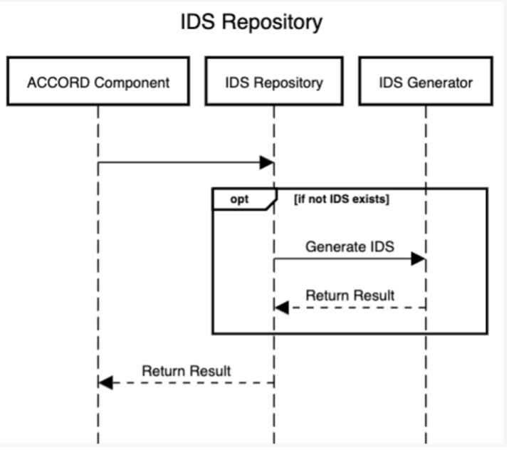

# Information Requirements Repository

This component is responsible for providing IDS data for a respective building code. This allows other ACCORD components to retrieve an IDS file for a given building code as required. This component implements the ACCORD building code and rules API for the serving of IDS files.

This component is implemented relatively simply. When a request for an IDS file is received, the service either returns the IDS file (if it already exists) or calls the IDS generator to generate an IDS file. This is shown in the sequence diagram below.

