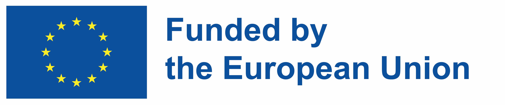

# ACCORD Project Documentation

## Introduction

This documentation site presents the technical documentation of all the artefacts developed in the ACCORD project. This documentation is designed for a technical audience. For more general information please see the ACCORD project website [here](https://accordproject.eu/)

It includes the following aspects developed in *WP2 (Semantisation of Regulations and Open Format for Machine-Readable Rules)*. These are presented under the **Rule Formalisation** category on the navigation bar:

1. The Building Compliance Rule Language (BCRL).
2. The Rule Formalisation Process and the BCRL Format.
3. Artificial Intelligence models and tools.
4. The Rule Formalisation Tool (RFT).
5. Semantic storage

This documentation also covers components developed in *WP4 (Solutions development)*.

1. The ACCORD Cloud Architecture
2. The Core ACCORD Cloud Components. Presented under the **ACCORD Core Components** category on the navigation bar:
3. The Core ACCORD APIs
4. ACCORD Integration Strategies
5. Compliance Checking Microservices. Presented under the **Compliance Checking Microservices** category on the navigation bar:

## More Information

For more general information on the ACCORD project, please visit the main proejct website [here](https://accordproject.eu/).

## Funding
{ height="50" }

This project has received funding from the European Union’s Horizon Europe research and innovation programme under grant agreement no. 101056973.

{ height="50" }

UK Participants in Horizon Europe Project [ACCORD] are supported by UKRI grant numbers [10040207] (Cardiff University), [10038999 ] (Birmingham City University and [10049977] (Building Smart International).
