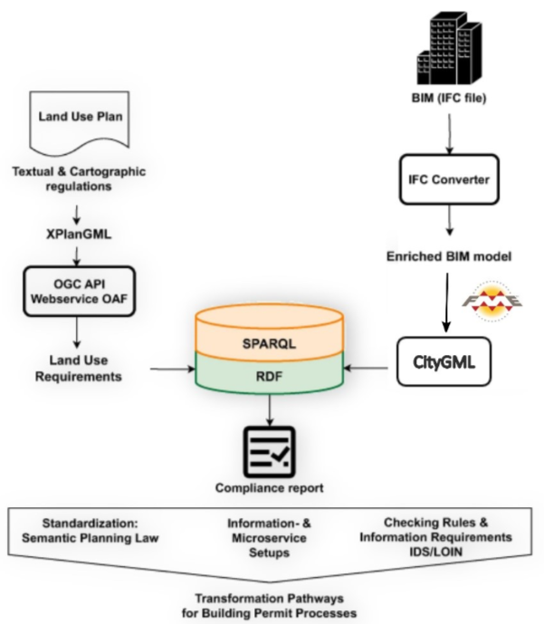
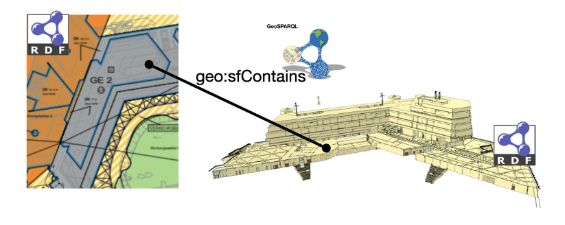
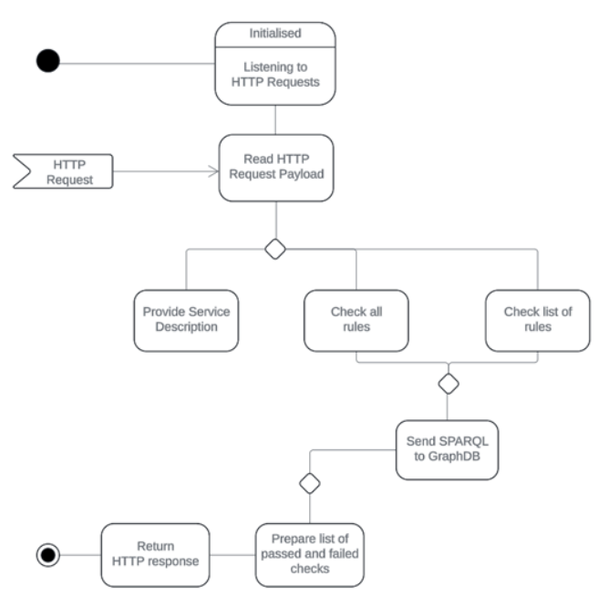

# Planned Land Use Checker

## General Microservice Description 

The purpose of this service is to automate the compliance checks of land use regulations applicable to buildings in Germany. It can be used in scenarios where land use regulations are specified in the XPlanung format, and building designs are stored in formats convertible to CityGML 2.0 or 3.0 regarding their spatial design and specification of uses of spaces. An example of such a format is IFC, also commonly used in Germany for Building Information Modelling. 

XPlanung is an open, XML-based data exchange format based on Geography Markup Language Version 3 (GML 3.2.2), the extensible standard for spatial data developed by the  Open Geospatial Consortium (OGC)  and ISO TC211. The CityGML standard defines a conceptual model and exchange format for the representation, storage and exchange of virtual 3D city models. The standard provides a framework for integrating, storing, and exchanging 3D geospatial data encoded in GML/XML.  

Transformation of BIM data in IFC format into CityGML 2.0 is implemented as a custom FME flow.   

## Microservice Implementation and Functionality 

This service transforms XPlanung and CityGML models into RDF graphs and topology relations between their geometries are materialised using predicates of the GeoSPARQL ontology. Materialised topological relations are equivalent to outputs of GeoSPARQL topological functions with sets of 2D and 3D geometries transformed from XPlanung and CityGML provided as arguments. Materialisation of topology relations between geometries in both models serves as a link between two models in one RDF graph, making both models semantically interoperable, as shown below:

SPARQL enables querying information from databases or any data source that can be mapped to RDF. The SPARQL standard is designed and endorsed by the W3C and helps users and developers focus on what they would like to know instead of how a database is organised. This service makes use of those capabilities of the query language to retrieve geometries of parts of a building that are topologically related to land parcels’ geometries, and check using more semantically rich descriptions of such building geometries whether the building complies with the requirements of the XPlanung. 

The service is implemented in Java using Spring Boot framework. The information flow, illustrated in the activity diagram, is as follows: 

- Upon initialisation, the service listens to HTTP Post requests. 

- Upon receiving a service description request, it returns a description of its functionality and the numbered list of implemented rules it is capable of checking in HTTP response. 

- Upon receiving the request to check all rules, it sends SPARQL queries, corresponding to every implemented check, to GraphDB and returns a list of passed and failed checks when all queries are finished, in HTTP response. 

- Upon receiving the request to check one or more specific rules, it sends SPARQL queries, corresponding to each check from the list, to GraphDB and returns a list of passed and failed checks when all queries are finished, in HTTP response. 
