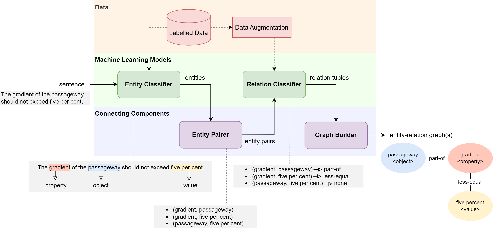
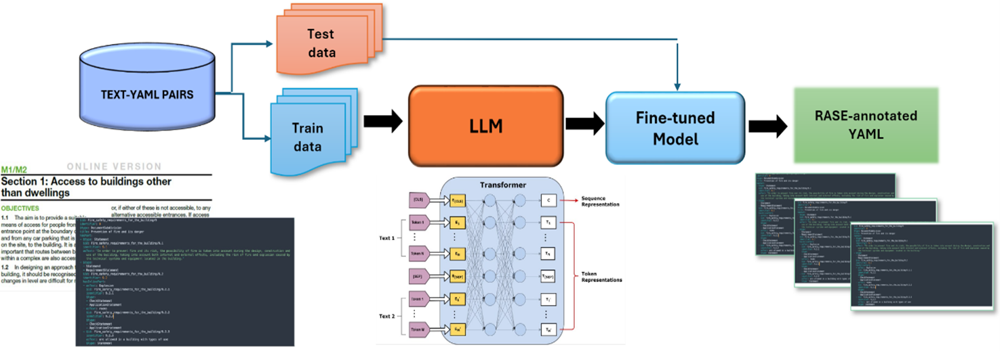
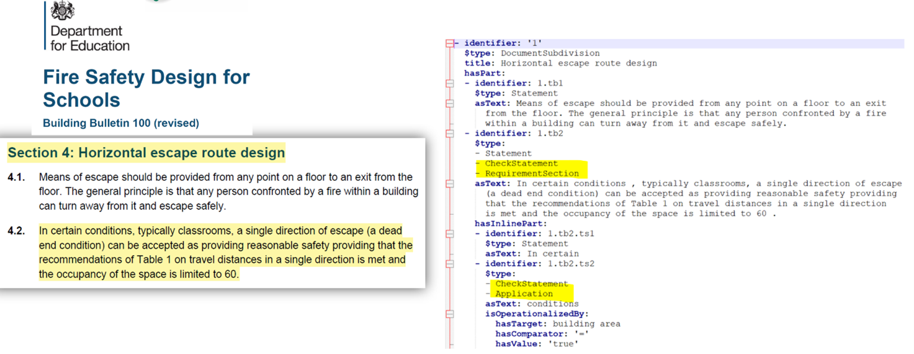

# NLP

 This page shows a suit of NLP technology to translate the text of building regulations into machine-readable formats which is a critical in ACC. This suite of AI-powered tools have been developed to automate this translation process, leveraging advancements in Large Language Models (LLMs) as well as transformer-based architectures for Named Entity Recognition (NER) in regulatory text. The models, the trained language models and the compiled regulatory text datasets can be accessed here.

## ACCORD-NLP: Data and AI Models

Within the ACCORD project, our primary focus has been on  exploring how the NLP techniques can be used for automatic rule formalisation and regulatory text interpretation. A brief review of how NLP techniques have been used to build regulatory data for rule generation as well as our SNOWTEC tool pipeline for extracting enetities from AEC regulatory text is summarised in the following video:

[Data and SNOWTEC Explained](https://tinyurl.com/2s3c24jd)

### SNOWTEC

 SNOWTEC leverages transformer-based architectures to extract and standardize information from regulatory sentences, converting them into knowledge graphs. This system uses the ACCORD-DATA to automatically process regulatory text written in natural language. The development specifically targets self-contained sentences — those that convey rules with complete details and no unresolved linguistic references, external sources, or ambiguous concepts. These types of sentences are crucial for Automated Compliance Checking (ACC) since they directly express rules that can be easily extracted.
SNOWTECH Information extraction pipeline converts a regulatory sentence into a knowledge graph showing the entities and their regulatory relations. 

 
> The code for building SNOWTECH pipeline is available through the following links:

1.	[The SNOWTEC Information Extractor Application](https://huggingface.co/spaces/ACCORD-NLP/information-extractor) 
2.	[SNOWTEC Codebase](https://github.com/Accord-Project/accord-nlp)
3.	[SNOWTEC Python Package](https://pypi.org/project/accord-nlp/)
4.	[SNOWTEC Pre-trained Models](https://huggingface.co/ACCORD-NLP)

### RASE Automation Tool

 The RASE Automation Tool is a web-based application developed as part of the ACCORD project. The tool harnesses the capabilities of artificial intelligence, specifically a fine-tuned GPT-4 model, to transform complex building regulation texts into a machine-readable YAML format. This innovative solution aims to reduce the time, effort, and errors associated with manually interpreting and converting regulatory documents, thereby supporting professionals in the construction, architecture, and compliance sectors. 

> The following video gives a demonstration of how the tool works:

### RASE Pipeline

  The pipeline of the tool is based on an automated text conversion mechnasim where the tool converts building regulations provided in PDF format into YAML files, enabling seamless integration into automated systems and applications.
It utilises a fine-tuned GPT-4 model to deliver contextually accurate and logically structured YAML outputs. It allows users to review and edit the AI-generated YAML files directly within the tool, ensuring adaptability and customisation for specific requirements.  

The figure below shows an example of a YAML extract created from regulatory text by our Rase Automation Tool. The tool automatically defines the paragraph (highlighted) in the textual regulations and builds a YAML file with the RASE annotations which reflect the logical relations (highlighted) between the entities. 

