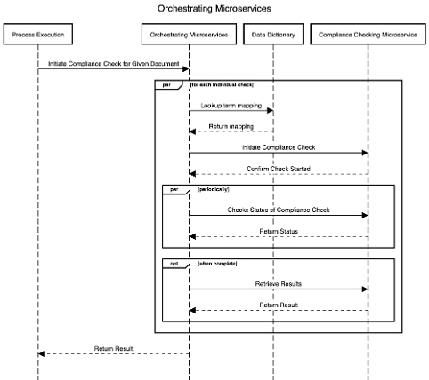

# Orchestrating Microservices Component:

The function of the orchestrating microservices component is to identify and manage the execution of compliance checking across the ACCORD compliance checking microservices. This service is required since the ACCORD Cloud Architecture will consist of multiple microservices, each of which may well have several different instances running.
Thus, this component performs two tasks. (1) It maintains a list of current ACCORD microservices, and (2) it selects and triggers compliance-checking microservices in order to execute compliance-checking against a given Building Code. 
3.9.2	

This component has implemented X key elements of functionality:

1.	Ability to maintain a list of available microservices
2.	Ability to call microservices to retrieve their functionality.
3.	Ability to parse BCRL and execute compliance checking on a given BCRL document by calling one or more compliance-checking microservices.

This will be delivered through two sub-components:

1.	Microservice Functionality register: A list of microservices with a set of their functionality. This functionality is retrieved by calling each microservice (using the results API) to retrieve their capabilities.
2.	BCRL Execution: This component performs the steps listed below for each building code that requires execution. This is shown in the sequence diagram, Figure 7.
	1.	Retrieve and parse BCRL from the repository of building codes. 
	2.	Determine and order of execution as defined within the BCRL.
	3.	For each individual compliance check to be executed
		1.	Lookup the definition stored in the bSDD.
		2.	Select a microservice for execution based on the microservice functionality register and the data in bSDD.
		3.	Call the microservice using the Results API.

