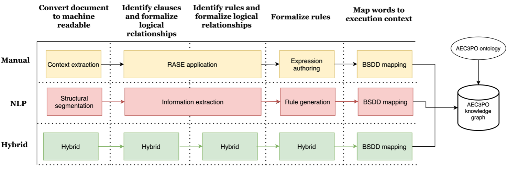
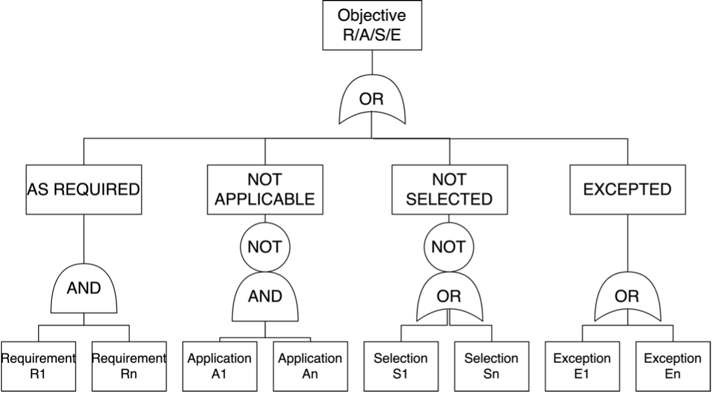
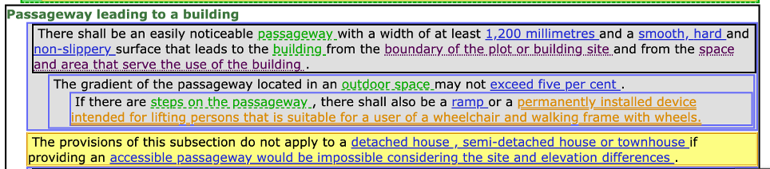
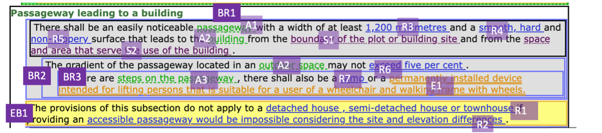
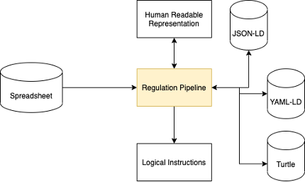
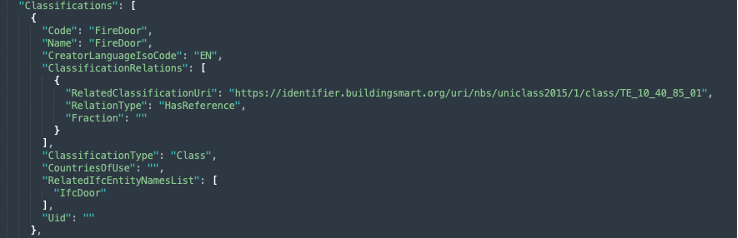

# Rule Formalisation Process and BCRL Format

This section of the documentation will document;

1. the ACCORD rule formalisation process,
2. the technologies used as part of this process, 
3. how the formalised regulation documents are serialised and
4. how the Building Smart Data Dictionary (bsDD) is utilised as part of the process.

To supplement this documentation [training on the ACCORD rule formalisation process](https://www.youtube.com/watch?v=oMwEXCzc3lc) is also provided in video form.
## ACCORD Rule Formalisation Process

## Introduction to RASE

## ACCORD BCRL Expressions

## BCRL Serialisation Format and use in a Ruleset Database

[Finland Example](./finland.md)
[Spanish Example](./spain.md)

## bsDD Mapping

