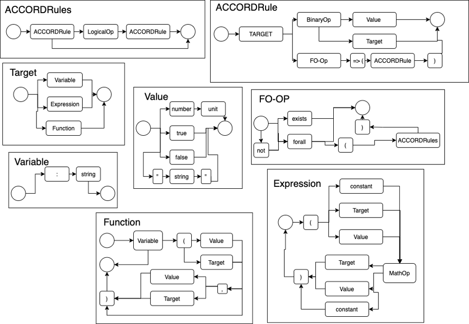
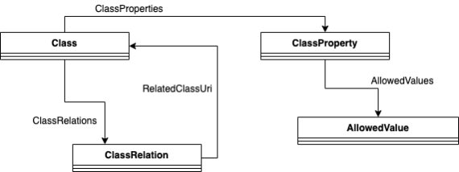

# Rule Formalisation Process and BCRL Format

This section of the documentation will document;

1. the ACCORD rule formalisation process,
2. the technologies used as part of this process, 
3. how the formalised regulation documents are serialised and
4. how the Building Smart Data Dictionary (bsDD) is utilised as part of the process.

To supplement this documentation [training on the ACCORD rule formalisation process](https://www.youtube.com/watch?v=oMwEXCzc3lc) is also provided in video form.
## ACCORD Rule Formalisation Process

The ACCORD rule formalization process includes five abstract steps, of which we will provide a manual, automated (NLP) and a hybrid approach. These steps are:

1.	Conversion to a machine-readable document: This abstract step will convert documents that are not easily machine-readable (documents where the contents with their semantic meaning cannot easily be extracted i.e., PDF, Word etc.) into a machine-readable document to serve as input for the remaining abstract steps. It should be noted that some documents in the regulatory domain are already in an easily machine-readable format, in this case this step can be skipped.
2.	Identify clauses and formalise logical relationships: This methodological step will seek to identify paragraphs and clauses that contain regulatory content. It will then identify and formalise how these paragraphs and clauses interact logically (e.g., providing AND/OR etc. relationships).
3.	Identify rules and formalise logical relationships: This methodological step continues from the previous step. It will formalise the words or phrases within each previously identified clause/paragraph that indicates a regulatory decision. Based on this, the logical relationship between each identified word/phrase will be specified.
4.	Formalise Rules: In many cases, each identified word/phrase from the previous step must be formalised into some form of logical decision. In many cases, this is a simple mapping of a term to a value (e.g., width == 5). However, in certain cases, due to the complex language used in regulatory documents, each word/phrase may well have more complex logical relationships involving several terms.
5.	Map words to execution context: Finally, each term identified from the previous phrases must be mapped to an execution context, i.e., it must be explicitly specified how the data associated with that term can be retrieved or calculated. This phase of the methodology will formalise these mappings.

A full description of this methodology is shown in below in the image.


The ACCORD manual methodology, which this page describes, consists of the following steps:

1. Content Extraction: The regulation to be considered will be manually transformed into a spreadsheet-based format that can then be automatically parsed to produce initial input for the manual digitisation methodology.

2. RASE Application: The identification of clauses, paragraphs and individual words and phrases, as well as the specification of their logical relationships, will be done using the RASE methodology. This is described in more detail in the "Introduction to RASE" section below.

3. Expression Authoring: This step will formalise the extraction of individual logical decisions. In most cases, this will be as simple logical operations; however, to deal with complex cases, a simple expression language will be proposed for use. This is described in the "ACCORD BCRL Expressions" section below.

4. bSDD Mapping: The mapping to the execution context will be performed using the BuildingSMART data dictionary; terms identified in the previous steps of the methodology will be mapped to terms within the bSDD. The definitions stored within this data dictionary will inform how the data associated with those terms can be retrieved/calculated. This is described in the "bsDD Mapping" section below.

## Introduction to RASE

The aim of the RASE process is to enrich the written text of the regulation with metadata that will allow other readers, including machines to pick out the key phrases and how they logically relate together. The key element of this process is examining a document to spot the short words and phrases that can be tested and larger parts of the document that organise these phrases into a logical structure. Whether looking for short phrases or larger elements, they will be serving one of four roles. The easiest to identify may be the Requirements, but there will also be Applications, narrowing the scope, Selections broadening the scope and Exceptions which eliminate from scope completely. This is shown in Figure 44.

The process of applying RASE to a regulation document consists of the following steps:

1. Distinguishing text that contains regulations/guidance from informative text (text that is purely descriptive or informational) and definitive text (text that defines the meaning of terms) and identifying and marking-up the sections.
2. Identifying and marking-up clauses that contain regulations. 
3. Identifying and marking-up complex terms (e.g., a clause that contains sub-clauses or extra conditions), tables, etc.


The result of this will be a document that has a series of colours applied to it using the RASE colours. These will take the form of boxes (to identify paragraphs and clauses) and highlights to identify individual words and phrases. This creates a hierarchical structure of nested boxes, with highlighted text forming the leaf elements of this structure. An example of this is shown in below:


Furthermore, the colours of the highlights imply a specific logical relationship between items at the same level in the hierarchy. This enables the generation of an explicit logical representation of the document. This abstract logical representation of this is shown below:


An example of this is presented in the image below. This image is based on the earlier example but with annotations added to represent each box (annotations containing B) and each phrase that has been highlighted in RASE. By applying the logical formula shown above, the logical formula for this set of clauses is:

1. Result = EB1 ∨ BR1
2. EB1 = R1 ∧ R2
3. BR1 = !A1 ∨ (!S1 ∧ !S2) || (R3 ∧ R4 ∧ R5 ∧ BR2)
4. BR2 = !A2 ∨ ( R6 ∧ BR3)
5. BR3 = !A3 ∨ E1 ∨ R7


## ACCORD BCRL Expressions

The next step is the formalisation of the logical decision behind each RASE highlighted word/phrase. In many cases, this will be as simple as defining a single logical comparison e.g., width > 10m. This has two key purposes (1) it introduced a formalised term (in the case of the example width) that is related to giving the RASE highlighted word/phrase and (2) it provides an explicit formalisation of how that RASE highlighted word/phrase can be determined to be true or false.

However, there are cases where, due to the complexity of the regulations, there is need for additional complexity. Based on past experiences this includes:

1. Dealing with regulations that consider connectivity and spatial considerations e.g., a building must contain one toilet suitable for a disabled person.
2. Dealing with regulations that have phrased two separate decisions as one decision e.g., a space must contain all applicable sanitary fittings.
3. Where regulations contain simple formulas that are useful to express explicitly within regulation document e.g., a given building must have 1 toilet for every 10 regular occupants.
4. Combinations of the above.

Based on these use cases simple expressions can be used to meet these needs. The motivation for adopting these simple expression as opposed to utilising a more complex languages is:
1. Simplicity – they can be authored by those with limited technical computing knowledge.
2. Familiarity – the use of commonly recognised operators and terms will enable wide accessibility to users.
3. Compatibility – the use of standard operators and structures enable expressions to be parsed and generated by a variety of software tools and user interfaces.

The syntax of the expressions is described in the image below, additionally the syntax has been formalised into an ANTLR grammar, to enable the rapid development of software components based on these expressions. This ANTLR grammer can be found [here](https://github.com/Accord-Project/RegulationTransformationTool/blob/main/src/main/antlr4/Accord.g4). Railroad diagrams can be found [here](https://docs.accordproject.eu/#railroad.html).



Examples of this are presented in the table below:

| Example | Expression	Description |
| ------- | ------------------------|
| :IsExternal == true	| Checks if a given object is outside of the building (or part of it is outside). |
| :Width > 1.2 :M	| Checks if the width is greater than 1.2 metres. |
| :type == :House	| Checks if the type of an object is a house. |
| :UsageCategory==:IV	| Checks if the usage category of a object matches the classification code IV. |
| :Walls exists => (:IsExternal == true)	| Checks if a given object has a wall that is external. |
| :AdjacentSpaces forAll => (:FireSafeDesign==true)	| Checks if all adjacent spaces have a fire safe design. |
| (:tan( ( :Slope *(pi/180) ) )*100) > 5%	| Checks if Tan(x*pi/180)*100 is > 5%. |
| :Contains exists => ( :type == :LiftingDevice && :IsPermanent == true && :SuitableForWheelchair == true && :SuitableforWalkingFrame == true) | Checks if a given object contains another object that is a permanent lifting device that is suitable for wheelchairs and walking frames.|


## bsDD Mapping

The final stage in the ACCORD digitisation methodology is how each term, elicited as part of the expressions defined in the previous section, can be retrieved, or calculated. This consists of two steps: (a) identify what type of retrieval/calculation should take place, and (b) defining the specifics of the retrieval/calculation.

The buildingSMART Data Dictionary (bSDD) is an online service hosting classes (terms) and properties, allowed values, units, translations, relations between those and more. It provides a standardised workflow to guarantee data quality, information consistency and interoperability. The bSDD schema is shown below:



Use of bSDD allows the creation of custom data dictionaries as well as the use of standardised data dictionaries provided by BuildingSMART. Access to bSDD is via a web-interface as well as API access. In practice, the construction sector uses bSDD for easy and efficient access to all kinds of standards to enrich their BIM models as well as to reference Information Delivery Specifications (IDS) and check BIM data for validity.


The first step in providing a mapping between a term and how it is retrieved/calculated from data in a model, is to identify at a high level how it will be retrieved/calculated. To achieve this the ACCORD project has developed a hierarchy from which a specific method of execution can be selected:

1.	Simple data lookup – the term is a simple data value that can be looked up from a data model.
2.	Process result – the term is a result of a complex process (i.e., energy analysis) and thus must be treated as a “black-box”. A specialist piece of software (termed a microservice within the ACCORD semantic framework) will need to be invoked to calculate this result.
3.	Cannot be checked – no value for the term can be retrieved/calculated automatically. Thus, human input is necessary to assess this item.

If options 1 or 2 are selected, the next step is to map the term to the given data value within a data model or the specific microservice within the wider ACCORD semantic framework. This is described in the next section.

To map a given term to bSDD, the following process is followed:

1.	The term being considered should be categorised as either an object or a property. If a property it should be added to bSDD as a ClassificationProperty, if it is an object, it should be a Classification.
2.	If the term is an object (e.g., Door): A Classification should be created in bSDD. If the term has an equivalent in any of the existing bSDD dictionaries (e.g., IFC classes, or Uniclass) then relationships between the new Classification and these related Classifications should be created. 
3.	If the term is a property (e.g., width): Firstly, the Classification of the property currently being considered should be inferred by the RASE meta-data present within the document (e.g., if the term is width, then what type of object the width is a property of should be inferred). This can be done automatically. Then depending on the selected execution type, one of the following should be performed:
	
	1.	Simple data lookup: A relationship should be established between the inferred Classification and the appropriate ClassificationProperty in the target bSDD dictionary (depending on what model format is the target).
	2.	Process result: A new ClassificationProperty should be created. The bSDD IsDynamic property is set to true and a URI for the process application is also saved.
	3.	Cannot be checked: A new ClassificationProperty should be created, but no other action taken.

This will result in the creation of a series of mappings in the bSDD JSON format. This is shown below. Specifically, this example shows the classification “FireDoor” and its mapping to an existing Classification in the uniclass bSDD dictionary, as well as its relation to the IfcDoor Classification.


## BCRL Serialisation Format and use in a Ruleset Database

Once the digitisation process has been completed its output will be in the form of an instance of an instance of the [AEC3PO](aec3po.md) ontology. This is conventionally represented as YAML-LD, which can also be converted into JSON-LD as well as other standard ontology formats. (i.e., Turtle). To enable other components within the ACCORD semantic framework to make use of the digitised regulatory documents they will be hosted in [GraphDB](graphdb.md) triple store enabling other components to query them via an API. This is shown in the image below:


In addition to the Ontological representation a HTML representation can be used. This is to enable the serialised regulatory documents to be made human readable. This is based on the ComplianceDocument format proposed by the D-COM project (documentation [here](https://d-com-network.github.io/DCOMDocumentation/compliancedocument/) ). A dedicated tool has been created to convert between these formats. This tool can be downloaded [here](https://accord-project.github.io/RegulationTransformationTool/RegulationTransformation.jar).

The command line parmaters for this tool are:

```
java -jar RegulationTransformation.jar <inputfile> <outputfile> 
```

The tool detects the input from the file extension. The following file formats are supported:

1. .html - The HTML format
2. .yaml - YAML format
3. .jsonld - JSON-LD format

Two examples of these formats are provided below:

1. [Finland Example](./finland.md)
2. [Spanish Example](./spain.md)
