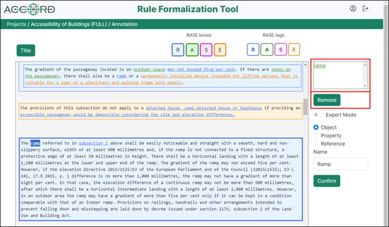
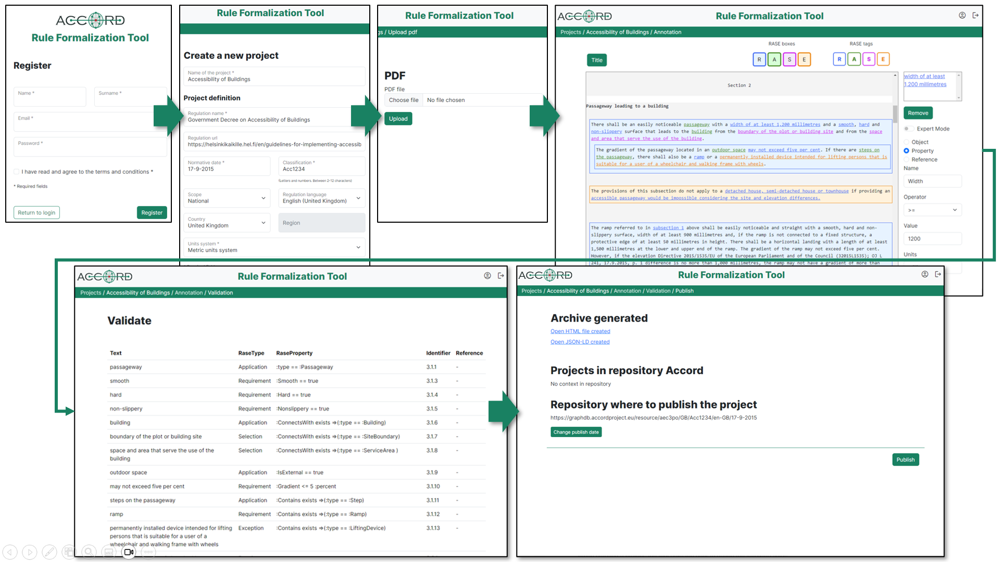

# Rule Formalisation Tool (RFT)

This section provides the documentation for the tool that implements the Rule Formalisation Process documented [here](https://github.com/Accord-Project/ACCORD-Documentation/blob/main/docs/process.md).

## Description

- The RFT is a web tool created to allow municipal technicians and rule creators assisted by RASE experts to complete the rule formalisation process without programming nor manually generating each part of the formalisation process.

 
- The implementation of the tool has involved developing a solution that integrates the following components to generate the regulation graphs at the end of it:
  1. [RASE method](https://github.com/Accord-Project/ACCORD-Documentation/blob/main/docs/process.md).
  2. [AEC3PO ontology](https://github.com/Accord-Project/ACCORD-Documentation/blob/main/docs/aec3po.md).
  3. [BCRL language](https://github.com/Accord-Project/ACCORD-Documentation/blob/main/docs/process.md).
  
- The tool enables two alternatives for users to carry out the process:
  1. Manually by tagging the regulation text according to the RASE method, and generating the rules in BCRL.
  2. Automatically through a solution based on Natural Language Processing (NLP), which is described [here](https://github.com/Accord-Project/ACCORD-Documentation/blob/main/docs/nlp.md).

## Interfaces

The rule formalisation tool has been implemented as a web application where users can register and create projects for each regulation to be transformed into machine-processable format. 
The usual data such as name, surname, email address, etc. are requested during registration. Once registered, the user can begin to perform several actions to carry out rule formalisation process for one or more regulations.

## Installation

The Rule Formalization Tool has been conceptualized as a web application developed using the Symfony PHP framework to allow users to carry out the rule formalisation process of a regulation in an interactive manner, through a set of web interfaces and some functionalities. Deploying the tool on a server requires the installation and configuration of a set of components and technologies that includes the Symfony framework but also Python and Java.

- The code and components of the tool are available in the following [repository](https://github.com/Accord-Project/RuleFormalizationTool) on Github, along with instructions detailing how to deploy it.

## Access to the tool

- You can access to the tool in the following [link](https://arc.salleurl.edu/accord/login).
