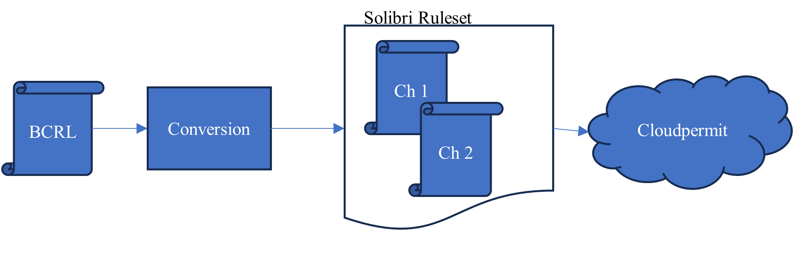
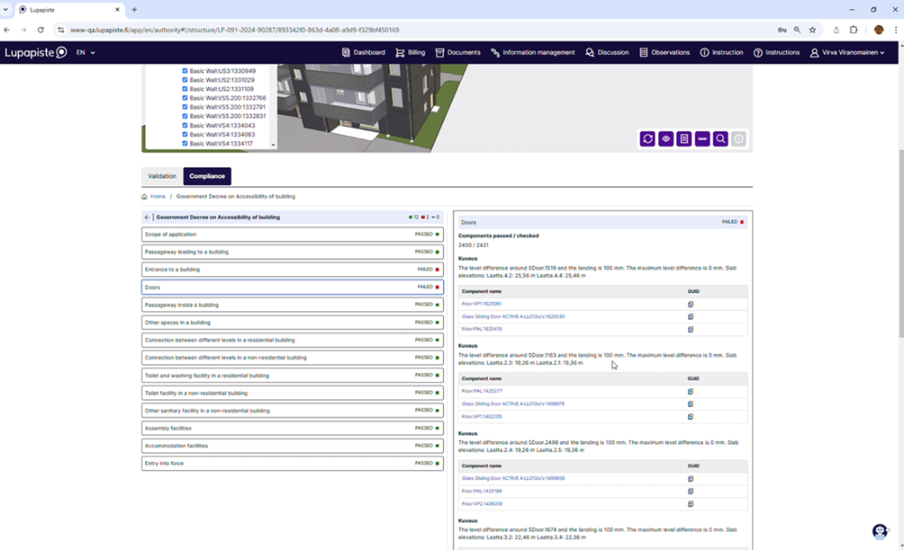
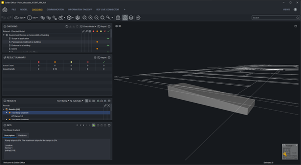

# [Solibri](https://www.solibri.com/) and [Cloudpermit](https://cloudpermit.com/)

[Solibri Checking as a Service](https://checking-api-docs.solibri.com) (CaaS) checks IFC files against building codes. The service is based on the existing industry-proven Solibri technology that is adapted to be used through an API. An integrating party can send their IFCs and building code specifications through the API. The results are provided in BuildingSmart's BCF format and JSON. The building code specifications can either be in Solibri's proprietary Ruleset format or in the BCRL language format that is developed in the ACCORD project. Thus, to implement this microservice, Solibri has added the ability to fetch and process BCRL from the rule repository to perform checks. 

In the context of the ACCORD project and this work, the integrating party is [Lupapiste](https://www.lupapiste.fi/), a permitting service by Cloudpermit that leverages the Solibri CaaS checking capability through the API. In the ACCORD architecture schema, it also implements some functionalities of the process execution and data storage components. Lupapiste is used as a user interface and process management system in any permit application process. It collects and hosts all the data for each individual permit application and contains all checks and configurations required to run the automatic checks.

# Checking against BCRL
## Pre-processing of BCRL
Solibri has a utility that takes BCRL as input and converts it to a Solibri Ruleset, containing one rule for each BCRL section. Each rule contains the BCRL of that section as a YAML string. The pre-processed BCRL Rulesets are stored in Cloudpermit’s local rule repository for later use.

## Running BCRL against IFC
When an IFC model is submitted in a permit application and needs to be checked, Cloudpermit calls the Solibri API and sends the model and the Rulesets to Solibri CaaS for checking. Cloudpermit selects the Rulesets based on the type of the project and the type of the building to speed up the automatic checking. 
Solibri evaluates each BCRL rule against each component in the model. When a component matches all applicabilities and does not match any exception and finds itself in a requirement, it is checked against the requirement. If the requirement is not met, an issue is created.
The API hides the complexity of the microservice checks from the permitting service and returns the complete result sets in a standard way independent of the format of the check. Cloudpermit is agnostic to the format of the Rulesets; they can be proprietary Solibri format or BCRL.

It is also possible to run the BCRL check in Solibri UI without the integration to Cloudpermit.
