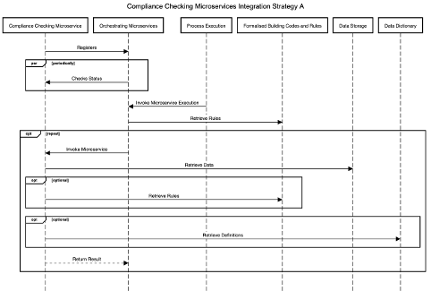
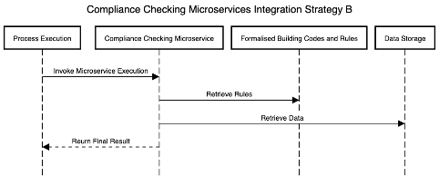

# ACCORD Integration Strategies

The ACCORD cloud architecture can be integrated with compliance-checking microservices in two ways, depending on the requirements of the permitting process being executed. 

**Integration Strategy A:** This integration strategy makes use of the Orchestrating Microservices component. In this case, the Orchestrating microservices component parses the rules provided by the building codes and rules repository and invokes one or more microservices to complete compliance checking. It is also responsible for integrating the results of the compliance checking from these microservices into a result. The sequence diagram for this execution strategy is shown in below:

**Integration Strategy B:** This integration strategy bypasses the Orchestrating Microservices component and instead invokes a single microservice to perform the entire compliance checking process for a given building code. This microservice will be responsible for parsing the BCRL, fetching data and performing all required compliance checks before returning results to the process execution component. The sequence diagram for this execution strategy is shown below:

| Integration Strategy A |	Integration Strategy B|
| ---------------------- |  --------------------- |
| Enables use of multiple microservices to perform compliance checking on a given building code. | Microservices must parse and understand BCRL.
| Microservices are not required to implement BCRL parsing.	| Self-contained checking. |
| Microservices are loosely coupled. | Gives microservice developers full control over the checking process. |
| The orchestrator can use multiple microservices to calculate the most efficient route to determining compliance.	| Cannot make use of multiple microservices. |
