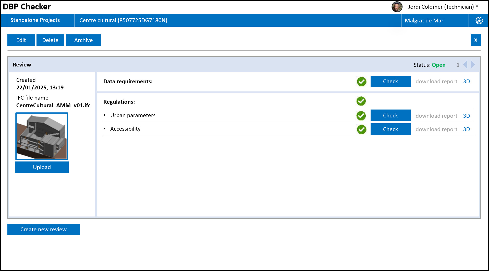

# Urban Regulations

## 1. Microservice

### 1.1. General Microservice Description
The purpose of the microservice that implements the regulation of urban planning parameters is to automate the process of checking the compliance of building project proposals – for new construction buildings and the renovation of existing buildings – with the urban parameters defined in municipal urban planning plans. This type of check is typically conducted by municipal technicians in city or town councils in countries such as Spain.

### 1.2. Microservice Implementation and Functionality
This microservice is composed of four parts, each of which is executed in a specific execution order, as shown in Figure 1. 

\
Figure 1. Urban Regulations Structure.

All the parts have been implemented using Python language and Django, a high-level Python web framework, for their deployment on a server. The source code is available on GitHub . The inputs for this microservice are a BIM model (in IFC format) and a cadastre file (in GML format).

<b>Pre-processing process:</b> This process enriches the data in the cadastre input files with the necessary information so that it can be properly processed by the Urban Regulations checker microservice, as well as removing data that is not necessary. This service is executed only once to generate this information for each cadastre input file. 

<b>IFC Data Requirements Checker:</b> This part is responsible for checking that the BIM of the building project complies with the data requirements necessary to ensure that the part for checking compliance with urban planning regulations is executed. These data requirements are provided in a file specified in the IDS standard format.

<b>Parcel Shape Checker:</b> This part checks if the perimeter of the parcel provided in the cadastre file coincides with the parcel's perimeter specified in the building project's BIM.

<b>Urban Regulation Checker:</b> This part checks that the building project complies with urban planning parameters defined in the municipal urban planning plans. To perform the checking, data from four different sources are required: (1) Cadastre data, (2) Topographic data, (3) urban data, and (4) project data provided in a BIM model represented in the IFC standard. 

The functions of this microservice are exposed to the ACCORD core components via an implementation of the Results API. 

### 1.3. Comparison against Relevant Technical Requirements
A comparison of the implemented functionality of this compliance-checking microservice and the relevant technical requirements defined in D4.1 is given in Table 18.
Table 17. Urban Regulations - Comparison against Technical Requirements

| TR No	| Requirement Description	| Implementation Detail | 
|-------|-------------------------|-----------------------|
| 68	| The system's checking of compliance with urban regulations must be automated. The permitting process will be applicable to both public and private buildings during the design and construction phases, using BIM and GIS as data input. 	| This microservice implements the urban regulation checking as described above. | 
|69|The system must allow to integrate GIS- and BIM data to carry out checking against urban regulations using one unified model.|As part of the pre-processing and parcel shape checking elements of this microservice, the GIS and BIM data are integrated for the purposes of compliance checking.|

##	2. Regulations 

### 2.1. General Description

The checking of the urban planning regulations of the municipality of Malgrat de Mar, which is similar to that of other municipalities in Spain, checks that BIM models in IFC format of building project designs delivered by the applicants comply with said regulation. As indicated in D4.2 “ACCORD Building Compliance Checking Components, Microservices and APIs”, the proposed solution includes three microservices: (1) Data requirement checker, (2) Parcel shape checker, and (3) Urban regulation checker. In addition to these microservices, there is another that enriches the data from cadastre input files with the information necessary for the urban regulations checker microservice to process them correctly, in addition to removing unnecessary data.

The data requirement checker is responsible for checking that the BIM model in the IFC format meets the data requirements necessary for the checking of the different urban planning parameters to be carried out correctly. An example is verifying that the BIM model provides georeferencing information. This information is necessary to determine whether the building project – to be constructed or renovated – is correctly located in relation to the geometry of the parcel extracted from the cadastre. The information must be included in the model, although its value is checked in the following microservice designed for this purpose. This check is performed using the IDS standard. If the requirements are not met, the microservice reports all the data requirements that are not met in the model. The result is returned in the BCF standard.

Parcel shape checker is the next microservice called once the data requirements have been verified. This checks the similarity between the parcel geometries defined in the BIM model in IFC format and those provided by the cadastre. If the two geometries are not practically identical once georeferenced, it cannot be guaranteed that the subsequent checking of the urban planning parameters in the urban regulation checker will be correct. The result of the check is also returned in the BCF standard.

The urban regulation checker can be carried out once it has been verified that the BIM model meet with the requirements. This microservice is composed of several “atomic” functions, implemented in Python language, designed to verify each of the steps required to check each urban parameter. The functions are invoked from an orchestrator component which is the responsible to interpret the regulation defined as RDF model according to the AEC3PO ontology. For each part of the regulations to be checked based on the project conditions (Urban code zone, etc.), the orchestrator performs the corresponding calls by passing the different parts that make up the associated BCRL expression as parameters. The result of each check is reported in the BCF standard.

### 2.2. Validation with real BIM models

Microservices have been tested through demonstrations with BIM models of two building projects: renovation of a cultural centre and a production plant expansion, provided by the Malgrat de Mar city hall. However, additional simple BIM models have been created specifically to evaluate other urban planning parameters not applicable to these two buildings.

### 2.3. Validation with a testing client application

To verify the correct operation of the three microservices, a client web application has been developed for applicants and municipal technicians. The application includes a small 3D viewer in which it is possible to check the errors indicated in the BCF files reported by the microservices in case errors have occurred, both in the checking of data requirements and/or urban regulations.

\
Figure 2: Checking interface for the client web application developed to test the microservices.

